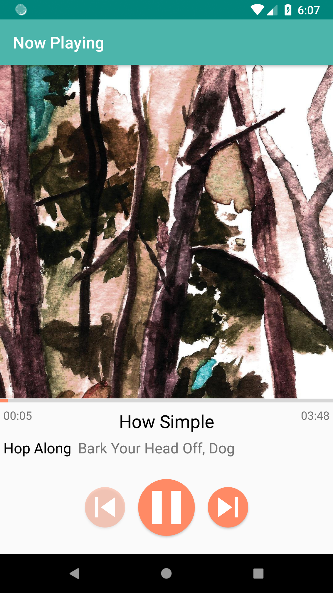

# MusicalStructureApp
This is the beginning of an Android music player app; Project 4 for the Android Basics Nanodegree

There are 6 different Activites:
<ul>
<li>Main Menu</li>
<li>List of Artists</li>
<li>List of Albums</li>
<li>List of Songs</li>
<li>Album Details</li>
<li>Now Playing</li>
</ul>

Everything is dynamically generated. The List of Albums Activity, for example, can either show all albums in the database or all albums by a chosen artist. The songs database is stored in a JSON file which itself was generated from an Excel CSV document. I used the CSV to JSON converter here: http://www.convertcsv.com/csv-to-json.htm

Right now the app doesn't actually play music. I wanted to use real album data and make the app structure easily test-able but didn't want to illegally upload MP3s as part of the project. If I continue development I'll make the app an MP3 player which generates its own database from MP3 metadata rather than having to rely on the JSON database.

Android Studio complains that the dimensions of the pixel density variations of the drawables (mdpi, hdpi, xhdpi, xxhdpi) are too different from each other but they conform to the (1.0x, 1.5x, 2x, 3x) multipliers suggested on the <a href="https://developer.android.com/training/multiscreen/screendensities#TaskProvideAltBmp">Android Developer Website</a>. It also complains that none of the album cover images are used, but they all are.
 
<table>
<tr>
  <td></td>
  <td></td>
  </tr>
</table>
